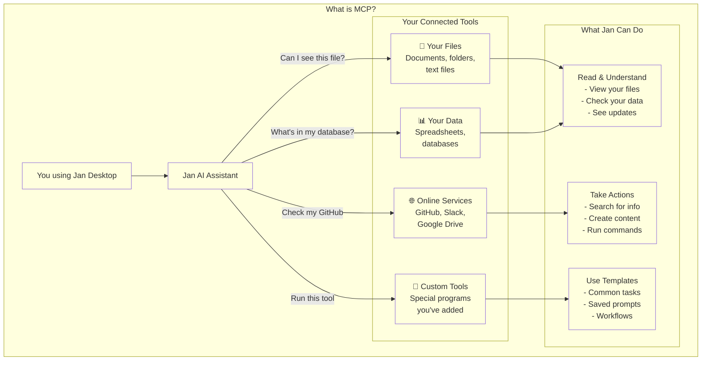

---

title: 模型上下文协议
description: 本地管理您与AI的交互。
keywords:
  [
    Jan,
    可定制智能, LLM,
    本地AI,
    隐私优先,
    免费开源,
    私有离线,
    对话式AI,
    无订阅费,
    大语言模型,
    线程,
    聊天记录,
    线程历史,
  ]
---

import { Callout, Steps } from 'nextra/components'

# 在Jan中使用模型上下文协议(MCP)

Jan现已支持**模型上下文协议(MCP)**，这是一个开放标准，旨在让语言模型能够与外部工具和数据源进行交互。

MCP作为通用接口，标准化了AI模型与外部工具和数据源的交互方式。这使得模型可以连接任何符合MCP标准的工具，而无需进行定制化集成工作。其工作原理是通过客户端和服务器实现的。客户端连接着AI模型和用户描述任务需求的主机。这些托管客户端的应用程序需要连接不同的数据源来完成任务，例如Notion、Google表格甚至自定义API。这些应用程序将连接到包含提示词、工具和数据源的服务器，用于完成任务。

Jan是一个MCP主机，允许您下载不同的客户端和服务器并使用它们来完成任务。

本文档概述了Jan中MCP的优势、风险及实现方式。

## MCP的核心优势

集成 MCP 为扩展 Jan 中使用的模型能力提供了结构化方案。以下是三大核心优势：

* **标准化**：MCP 致力于解决 "M x N" 集成难题——即每个模型(M)需要为每个工具(N)开发专属连接器。通过适配统一标准，任何兼容模型都能与兼容工具交互。
* **可扩展性**：您可为模型赋予新能力。例如通过同一协议，AI 可获得搜索本地代码库、查询数据库或调用 Web API 等能力。
* **灵活性**：标准化接口使得模型或工具的替换几乎无摩擦，让工作流随时间推移更具模块化和适应性。

<Callout type="warning">
  请注意：并非所有可下载使用的模型（无论是在 Jan 还是其他工具中）都擅长工具调用或兼容 MCP。在将模型集成到工作流前，请确认其符合 MCP 规范。相关信息可能存在于模型卡片中，您也可能需要自行实现功能来测试模型能力。
</Callout>

<Callout type="info">
  要有效使用 MCP，请确保您的 AI 模型支持工具调用功能：
  - 对于云端模型（如 Claude 或 GPT-4）：在 API 设置中确认已启用工具调用功能
  - 对于本地模型：在模型参数中启用工具调用 [点击模型能力中的编辑按钮](/docs/model-parameters#model-capabilities-edit-button)
  - 查阅模型文档以确认 MCP 兼容性
</Callout>

## 注意事项与风险

尽管功能强大，MCP 仍是一项发展中的标准，使用时需谨慎考虑以下要点：

* **安全性:** 授予模型访问外部工具的权限是一个重要的安全考量。工具被入侵或恶意提示可能导致意外操作或数据泄露。Jan 的实现方案通过用户自主管理权限来降低风险，这意味着您需要为每个工具单独开启权限。

* **标准成熟度:** 作为一个相对较新的协议，最佳实践和合理默认值仍在确立中。用户应注意潜在问题，如提示注入（精心构造的输入可能滥用工具功能）。

* **资源管理:** 活跃的 MCP 连接可能会占用模型上下文窗口的一部分，从而影响性能（即模型加载的工具越多、对话上下文越大，等待响应的时间就越长）。高效管理工具及其输出十分重要。

## 在 Jan 中配置和使用 MCP

我们将通过 [Browser MCP](https://browsermcp.io/) 示例演示如何在 Jan 中使用 MCP。

开始前，您需要在 `通用` > `高级` 中启用实验性功能。接着前往 `设置` > `MCP 服务器`，将 `允许所有 MCP 工具权限` 开关切换为开启状态。

请注意，您的机器上需要安装 **NodeJS** 和/或 **Python**。如果尚未安装，可通过以下官方链接下载：

- [Node.js](https://nodejs.org/)
- [Python](https://www.python.org/)

### 浏览器 MCP 配置

- 点击 MCP 界面右上角的 `+` 按钮。

- 输入以下配置信息：
  - **服务器名称**: `browsermcp`
  - **命令**: `npx`
  - **参数**: `@browsermcp/mcp`
  - **环境变量**: 此字段可留空。

- 确认服务器已成功激活。

- 打开您常用的基于 Chromium 的浏览器（如 Google Chrome、Brave、Vivaldi、Microsoft Edge 等），访问 [Browser MCP 扩展页面](https://chromewebstore.google.com/detail/browser-mcp-automate-your/bjfgambnhccakkhmkepdoekmckoijdlc)。

- 确保启用扩展在隐私窗口运行的权限。由于 Browser Use 将访问您常规浏览器会话中已登录的所有站点，建议为其提供全新的初始环境。

- 通过点击扩展并连接到浏览器 MCP 服务器，启用扩展在隐私窗口中的运行权限。

- 返回 Jan 应用，选择一个具备良好工具使用能力的模型，例如 Claude 3.7 和 4 Sonnet，或 Claude 4 Opus，
并通过界面启用工具调用功能：进入 **Model Providers > Anthropic**，输入 API 密钥后，点击 **+** 按钮启用工具。

您可以通过下方内容验证设置是否准确。

## 故障排除

- MCP 服务器无法连接，尽管已将其添加到 MCP 服务器列表？
  - 确保已安装 NodeJS 和 Python
  - 检查 MCP 服务器表单中的命令输入是否正确
  - 确认当前使用的模型已启用工具功能
  - 重启 Jan 应用
- 选择的开源模型无法使用已启用的 MCP 功能？
  - 确认当前模型已启用工具功能
  - 许多开源模型并非为工具使用设计或兼容性不佳，可能需要尝试其他模型
  - 所选模型可能支持工具调用，但不支持图像处理，因此无法兼容某些需要网站截图的功能（如 Browser MCP）

## 未来潜力

该集成是在Jan中创建更强大、更具情境感知能力的AI助手的基础。长期目标是实现更复杂的工作流程，既能安全利用本地环境，又能整合您喜爱的工具。

例如，AI可以交叉引用本地文档与远程API之间的信息，或使用本地脚本分析数据后汇总结果，所有这些都通过Jan的界面进行协调。随着MCP生态系统的发展，Jan内部的潜在应用也将不断扩展。